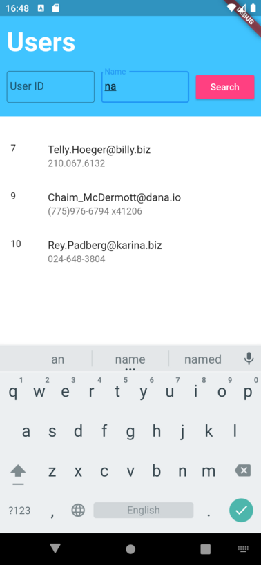

# Users

Displays list of users exposed by Rest API: https://jsonplaceholder.typicode.com/users

Each user in the list is represented by user id, email and phone as per requirements.

Available searching by user id and name (yes, name is not displayed, by search works for partial names).

The screenshot of the only screen:

